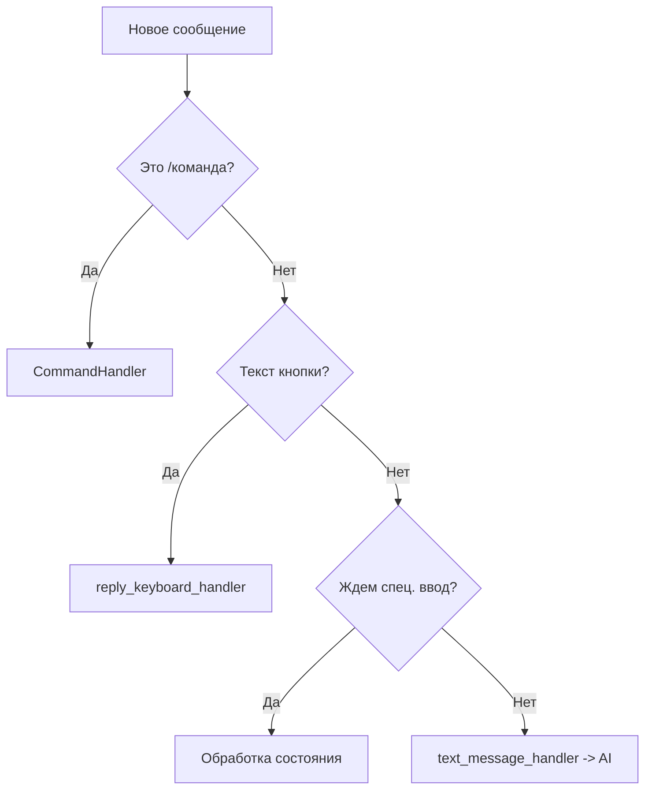

# План по наведению порядка с командами бота

## Проблема
В текущей реализации многие управляющие элементы (кнопки Reply Keyboard) отправляют текст, который перехватывается общим обработчиком `text_message_handler` и отправляется в ИИ для обработки. Это приводит к лишним затратам токенов и странному поведению бота.

## Цель
Изолировать системные команды от пользовательского контента, используя более строгие фильтры и централизованный список команд.

## Шаги реализации

### 1. Централизация названий кнопок
Вместо хардкода строк в регулярных выражениях, будем использовать `I18n` для получения всех возможных вариантов текста кнопок на всех языках.

### 2. Обновление фильтров в `setup_handlers`
Изменим порядок и логику фильтрации в [`telegram_bot/handlers.py`](telegram_bot/handlers.py).

```python
# Пример нового подхода к фильтрации
def get_all_button_texts():
    texts = []
    for lang in ['ru', 'en']:
        texts.append(I18n.get(lang, "buttons.settings"))
        texts.append(I18n.get(lang, "buttons.tma"))
        texts.append(I18n.get(lang, "buttons.profile"))
    return texts

# В setup_handlers
button_texts = get_all_button_texts()
button_filter = filters.Regex(f"^({'|'.join(map(re.escape, button_texts))})$")

application.add_handler(MessageHandler(
    filters.TEXT & ~filters.COMMAND & button_filter,
    reply_keyboard_handler
), group=1)

application.add_handler(MessageHandler(
    (filters.TEXT | filters.PHOTO | ...) & ~filters.COMMAND & ~button_filter,
    text_message_handler
), group=2)
```

### 3. Улучшение `reply_keyboard_handler`
Использование сопоставления ключей вместо прямого сравнения текста, чтобы обработчик не зависел от языка.

```python
async def reply_keyboard_handler(update: Update, context: ContextTypes.DEFAULT_TYPE):
    text = update.message.text
    user_lang = ... # получить язык пользователя
    
    if text == I18n.get(user_lang, "buttons.tma") or text == I18n.get('ru', "buttons.tma") or text == I18n.get('en', "buttons.tma"):
        # логика TMA
        pass
    # ... и так далее
```

### 4. Обработка состояния "ожидания ввода"
Убедиться, что когда бот ждет от пользователя ввод (например, новую инструкцию для ИИ), системные кнопки все равно работают или корректно игнорируются ИИ-процессором.

## Схема потока обработки



## Файлы для изменения
- [`telegram_bot/handlers.py`](telegram_bot/handlers.py): Основная логика фильтрации и распределения.
- [`telegram_bot/keyboards.py`](telegram_bot/keyboards.py): (Опционально) Добавление вспомогательных методов для получения текстов.
