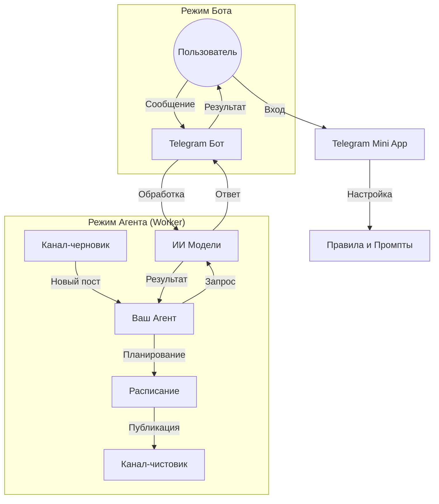

# 🐯 Руководство пользователя Taiger

Добро пожаловать в **Taiger** — инновационный сервис автоматизации Telegram-каналов с помощью искусственного интеллекта. Это руководство поможет вам настроить систему и начать экономить время на создании контента.

---

## 📑 Содержание
1. [Обзор системы](#обзор-системы)
2. [Авторизация и безопасность](#авторизация-и-безопасность)
3. [Режим «Бот» (Интерактивный помощник)](#режим-бот-интерактивный-помощник)
4. [Режим «Агент» (Полная автоматизация)](#режим-агент-полная-автоматизация)
5. [Настройка правил ИИ](#настройка-правил-ии)
6. [Расписание и публикация](#расписание-и-публикация)
7. [Баланс и VIP-уровни](#баланс-и-vip-уровни)

---

## 🚀 Обзор системы

Taiger работает одновременно в двух режимах, обеспечивая максимальную гибкость:

*   **Ваш Агент (Воркер):** Процесс, работающий от вашего имени. Он мониторит ваши каналы, обрабатывает посты и публикует их по расписанию.
*   **Telegram Бот:** Интерактивный интерфейс для быстрой проверки ИИ-моделей, управления настройками и получения уведомлений.

### Схема работы (Workflow)

---

## 🔐 Авторизация и безопасность

Для работы Агента требуется авторизация вашего Telegram-аккаунта. Это необходимо, так как обычные боты имеют ограничения на доступ к планированию постов и управлению каналами от лица пользователя.

1.  **Вход:** Откройте Mini App в боте и введите свой номер телефона.
2.  **Код подтверждения:** Введите код, который придет вам в официальный чат Telegram.
3.  **Сессия CPython:** В списке ваших устройств появится новый сеанс под названием `CPython`. Это и есть ваш Агент.
4.  **Безопасность:** Вы можете в любой момент отозвать авторизацию в настройках Telegram (Конфиденциальность -> Устройства).

---

## 🤖 Режим «Бот» (Интерактивный помощник)

Этот режим позволяет использовать мощь ИИ прямо в диалоге с ботом.

*   **Как пользоваться:** Просто отправьте боту любой текст, фото с подписью или перешлите пост. Бот мгновенно обработает его и вернет результат.
*   **Настройка моделей:** В меню бота выберите `🛠 Настройки бота` -> `📲 Выбор ИИ`. Вы можете настроить до двух слотов с разными моделями.
*   **Персональная инструкция:** Вы можете задать боту общую инструкцию (промпт), которой он будет придерживаться при ответах вам в личных сообщениях.

---

## ⚡ Режим «Агент» (Полная автоматизация)

Основная функция Taiger — автоматическое ведение каналов.

### Концепция «Черновик — Чистовик»
1.  **Канал-черновик:** Сюда вы (или другие источники) скидываете «сырой» контент, заметки или репосты.
2.  **Канал-чистовик:** Сюда Агент публикует уже «причесанные» ИИ посты.

### Мастер создания правил (Wizard)
Для настройки автоматизации используйте пошаговый мастер в приложении:
1.  **Выбор каналов:** Укажите источник (черновик) и назначение (чистовик).
2.  **Выбор модели:** От быстрых и дешевых до мощных и качественных.
3.  **Инструкция (Промпт):** Опишите, что ИИ должен сделать с текстом (например: *"Переведи на русский, добавь эмодзи и сделай текст более вовлекающим"*).
4.  **Параметры:** Настройте «Креативность» (Temperature) и «Вариативность» (Top P).

---

## 🧠 Настройка правил ИИ

*   **Удаление текста:** Вы можете указать фразы или ссылки, которые нужно вырезать из поста *перед* тем, как он попадет в ИИ.
*   **Инструкция для ИИ:** Это сердце вашего правила. Чем точнее вы опишете роль ИИ, тем лучше будет результат.
*   **Длина ответа:** Ограничьте максимальное количество токенов, чтобы посты не были слишком длинными.

---

## 📅 Расписание и публикация

Taiger не просто копирует посты, он создает естественную ленту публикаций.

*   **Случайная задержка:** Вы задаете диапазон (например, от 2 до 5 часов). Агент будет публиковать посты через случайные промежутки времени в этом интервале.
*   **Пакетная обработка:** При первом запуске Агент проверит последние 50 сообщений в черновике и запланирует их, если они еще не были обработаны.
*   **Режим прослушивания:** После обработки старых постов Агент переходит в режим ожидания и мгновенно реагирует на каждое новое сообщение в черновике.

---

## 🔋 Баланс и VIP-уровни

Работа ИИ-моделей требует ресурсов. В системе используется внутренняя валюта — **Энергия (🔋)**.

*   **Списание:** Энергия списывается за каждый успешно обработанный пост. Цена зависит от выбранной модели ИИ.
*   **Пополнение:** Для пополнения баланса обратитесь к администратору (контакт указан в профиле).
*   **VIP-уровни:**
    *   **Уровень 0:** Новички (приоритет в очереди запуска).
    *   **Уровень 1+:** Постоянные пользователи с увеличенными лимитами и временем работы Агента.

---

*Удачной автоматизации с Taiger! Если у вас возникли вопросы, загляните в раздел «Помощь» в Mini App.*
